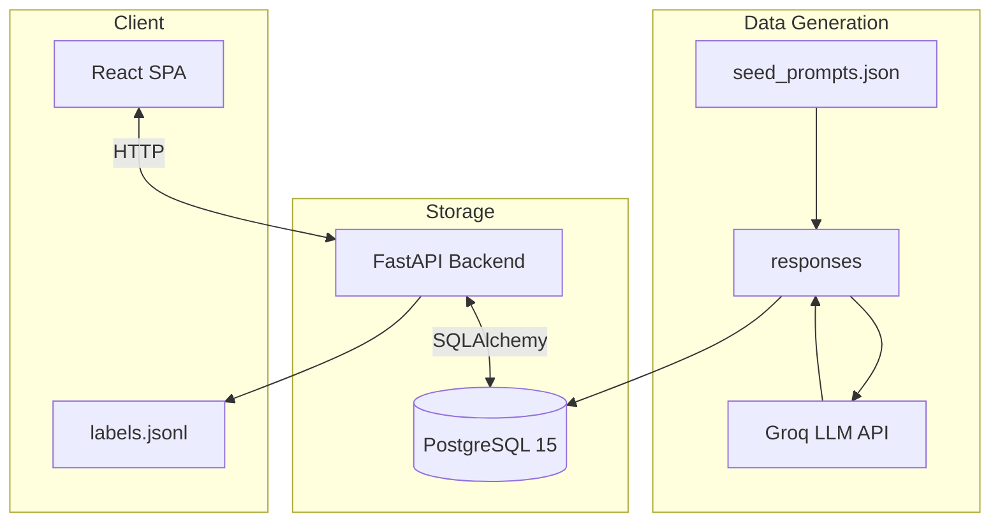

# RLHF Human Preference Labeling Platform

A full-stack, containerized web application for collecting pairwise human preference labels used to train reward models (RLHF).

## System architecture



---

## Quick start (Docker)

Prerequisites: Docker and Docker Compose installed.

1. Copy environment variables:

```bash
cp .env.example .env
# Edit .env and set GROQ_API_KEY and DB credentials
```

2. Build and start services:

```bash
docker-compose up --build -d
```

3. Run database migrations and seed data:

```bash
docker-compose exec app alembic upgrade head
docker-compose exec app python scripts/seed_data.py
```

4. Start the frontend (optional — can run locally or in container):

```bash
cd client
npm install
npm run dev
# open http://localhost:5173
```

---

## Project highlights

- FastAPI + SQLAlchemy backend for async APIs and robust DB access patterns.
- PostgreSQL for reliable storage and efficient pair selection.
- React + Vite frontend for a responsive labeling UI.
- Streaming JSONL export to avoid high memory usage when exporting large datasets.

---

## API endpoints (high level)

- `GET /api/pairs/next` — get next unlabeled prompt pair for an annotator.
- `POST /api/labels` — submit a human preference for a pair.
- `GET /api/analytics` — label distributions and simple agreement metrics.
- `GET /api/export` — stream validated `.jsonl` for downstream training.

---

## Troubleshooting tips

- If the DB container is reported `unhealthy`, check healthcheck in `docker-compose.yaml` and PostgreSQL container logs. Use `docker-compose logs db`.
- If `npx tailwindcss init -p` fails, ensure `tailwindcss` is installed in `client` and use the proper Tailwind version (v3 uses `init -p`; v4 requires Vite plugin setup).
- If running `npx create-vite` fails with `spawn C:\Windows\System32\cmd.exe ENOENT`, restart your terminal/IDE and verify `node` and `npm` are on `PATH`.

---

## Development notes

- Database: see `alembic/` for migration scripts.
- Seed data: `scripts/seed_data.py` populates example pairs by querying Groq LLMs (set `GROQ_API_KEY`).
